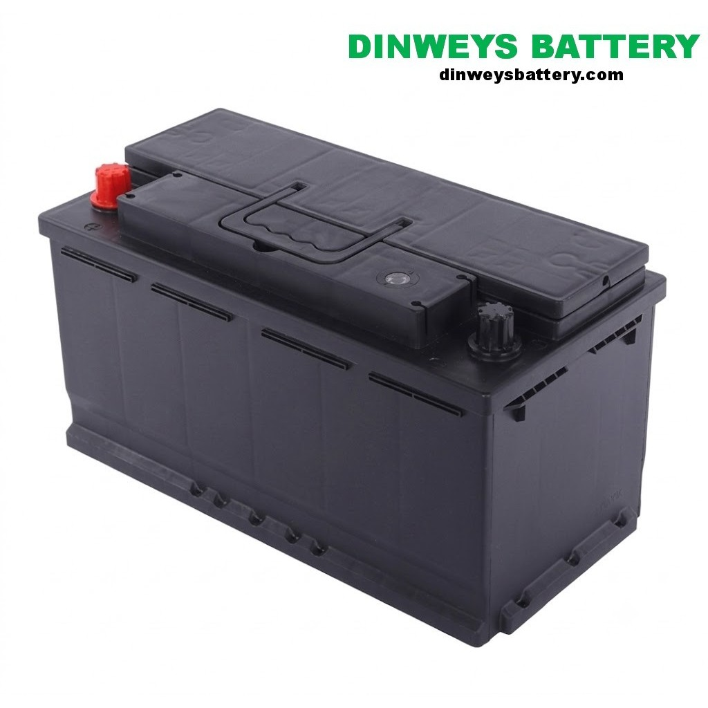
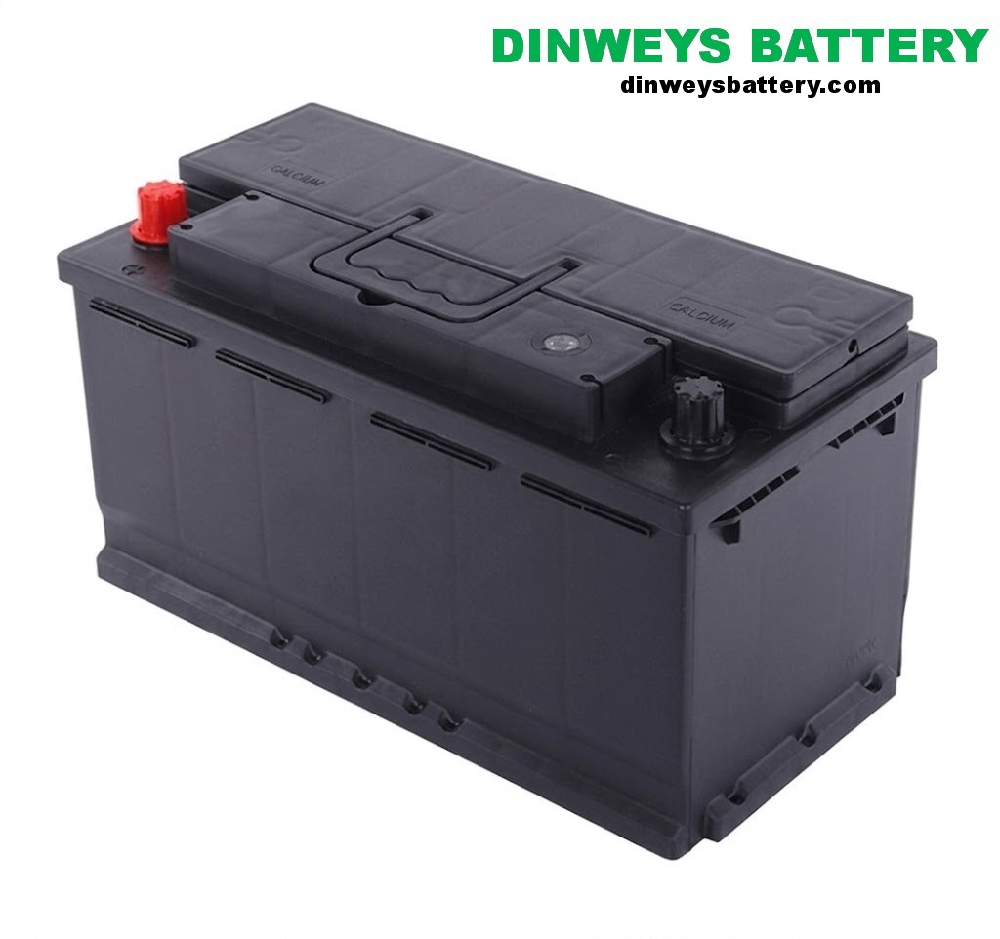

# DIN88 vs DIN100: European Heavy-Duty Battery Comparison

**TL;DR** — DIN88 (58827) is the standard European heavy-duty battery at 88Ah / 800A EN;
DIN100 (60038) is the larger option at 100Ah / 870A EN. Choose DIN100 for more cranking power
or higher electrical load if your tray fits it; otherwise DIN88 is lighter and cheaper.

## Model Photos

| DIN88 (58827) | DIN100 (60038) |
|---|---|
|  |  |

## What "DIN88" and "DIN100" Mean

In the DIN/EN system, the number reflects the battery's capacity in amp-hours. DIN88 is an
88Ah battery; DIN100 is a 100Ah battery. DINWEY manufactures these as the 58827 and 60038
models.

| Specification | 58827 (DIN88) | 60038 (DIN100) |
|---|---|---|
| Voltage | 12V | 12V |
| Capacity (C20) | 88 Ah | 100 Ah |
| Cold cranking (EN) | 800 A | 870 A |
| Reserve capacity (RC) | 150 min | 170 min |
| Dimensions (L×W×H) | 353 × 175 × 190 mm | 393 × 175 × 190 mm |
| Terminal | European conical (T1) | European conical (T1) |
| Typical use | European trucks, buses | Larger trucks, cold climates |

*Specifications from Chengguang Energy technical data center.*

## Side-by-Side Comparison

### Capacity and CCA

The DIN100 delivers about **14% more capacity** (100Ah vs 88Ah) and **9% more cold-cranking**
(870A vs 800A EN) than the DIN88. Choose DIN100 for:

- Larger European truck engines (MAN, Scania, Volvo, Mercedes, DAF)
- Colder climates where extra CCA matters
- Vehicles with heavier electrical loads

### Size

The DIN100 is **40mm longer** (393mm vs 353mm) than the DIN88. Before choosing, confirm your
battery tray length.

### Cost

The DIN88 is the more economical choice. If your engine starts reliably on 800A EN, the DIN88
provides the same build quality at lower cost and weight.

## How to Choose

| Question | Choose DIN88 (58827) | Choose DIN100 (60038) |
|---|---|---|
| Tray length | Up to ~353mm | Up to ~393mm |
| Engine size | Standard European truck | Larger / high-demand |
| Climate | Temperate | Cold |
| CCA need | Up to ~800A EN | Up to ~870A EN |

!!! note "Confirm against your manual"
    Always confirm the required size and cold-cranking rating in your vehicle manual. The
    wrong physical size cannot be safely installed.

## 24V Systems

Both are 12V batteries. In 24V European truck systems, two are wired in series — for example
two DIN100 units for maximum 24V cranking power. Always replace the pair together.

## References

1. [DIN — German Institute for Standardization](https://www.din.de/en)
2. [Cold Cranking Amperes — Wikipedia](https://en.wikipedia.org/wiki/Cold_cranking_amperes)

## Related

- [Truck Battery Complete Guide](../complete-guide/index.md)
- [JIS N150 vs N200](../jis-n150-vs-n200/index.md)
- [DINWEY DIN heavy-duty batteries](https://dinweysbattery.com/products/din-heavy-duty/)
