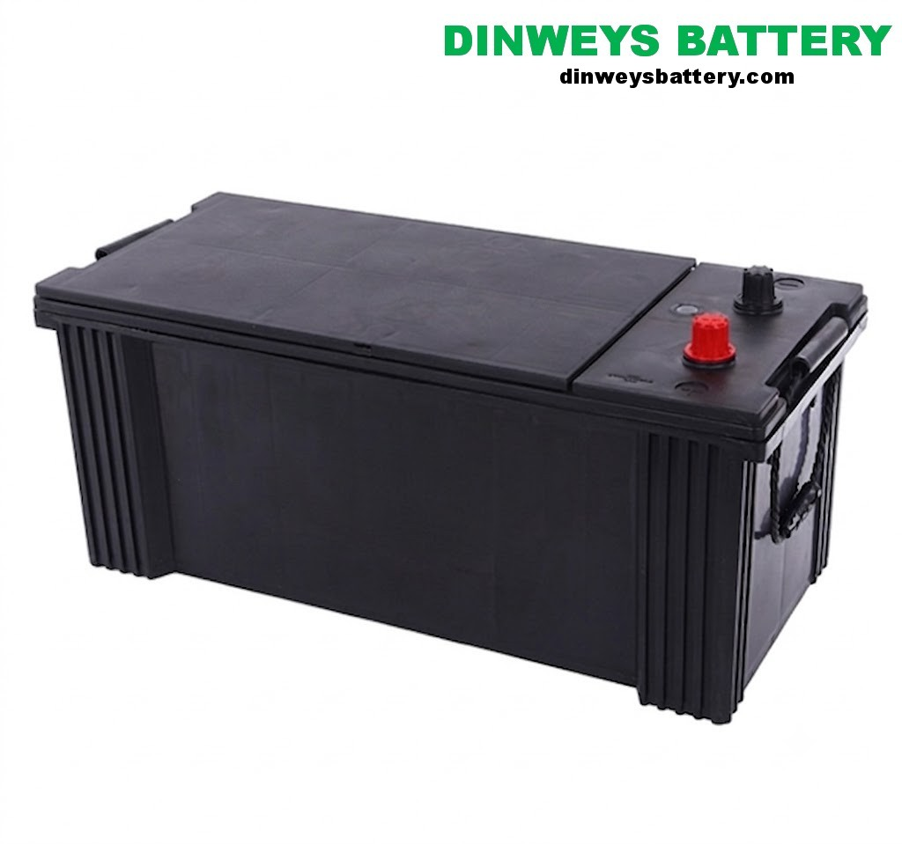
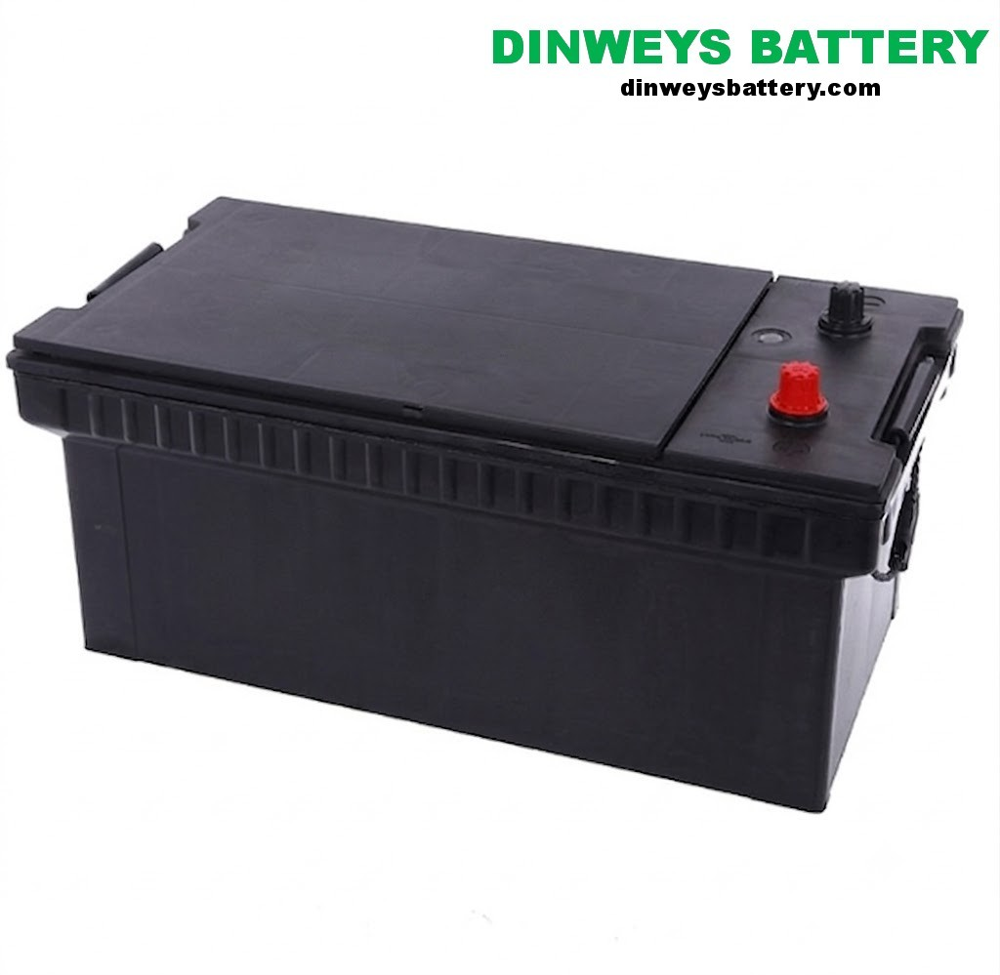

# JIS N150 vs N200: Which Heavy-Duty Truck Battery?

**TL;DR** — N150 (145G51) is the standard heavy-duty JIS battery at 135Ah / 900A CCA; N200
(190H52) is the larger, more powerful option at 200Ah / 1100A CCA. Choose N200 when you need
maximum cranking power or cold-climate reliability and your tray fits it; otherwise N150 is
lighter, cheaper and enough for most heavy trucks.

## Model Photos

| N150 (145G51) | N200 (190H52) |
|---|---|
|  |  |

## What "N150" and "N200" Mean

In the JIS (Japanese Industrial Standards) system, large commercial batteries are identified
by a model code where the number roughly tracks size and capacity. The "N" prefix denotes a
large heavy-duty battery. DINWEY manufactures these as the 145G51 and 190H52 models.

| Specification | 145G51 (N150) | 190H52 (N200) |
|---|---|---|
| Voltage | 12V | 12V |
| Capacity (C20) | 135 Ah | 200 Ah |
| CCA (SAE) | 900 A | 1100 A |
| Reserve capacity (RC) | 220 min | 320 min |
| Dimensions (L×W×H) | 508 × 222 × 212 mm | 520 × 278 × 220 mm |
| Terminal | JIS type A (large post) | JIS type A (large post) |
| Typical use | Heavy trucks, buses | Largest trucks, buses, generators |

*Specifications from Chengguang Energy technical data center.*

## Side-by-Side Comparison

### Capacity and CCA

The N200 delivers about **48% more capacity** (200Ah vs 135Ah) and **22% more CCA** (1100A vs
900A) than the N150. This makes the N200 the better choice for:

- Large-displacement diesel engines (bigger starter current draw)
- Cold / Arctic climates (where CCA matters most)
- Vehicles with heavy electrical loads when idling

### Size and Weight

The N200 is **deeper** (278mm vs 222mm) and heavier than the N150. Before choosing, confirm:

- Your battery tray dimensions
- The hold-down bracket compatibility
- That the added weight is acceptable for your application

### Cost

The N150 is the more economical choice. If your engine starts reliably on 900A CCA, the N150
gives you the same chemistry and build quality at a lower cost and weight.

## How to Choose

| Question | Choose N150 (145G51) | Choose N200 (190H52) |
|---|---|---|
| Tray depth | Up to ~222mm | Up to ~278mm |
| Engine size | Standard heavy diesel | Large / high-compression diesel |
| Climate | Temperate / hot | Cold / Arctic |
| CCA need | Up to ~900A | Up to ~1100A |
| Budget | Lower | Higher |

!!! note "Confirm against your manual"
    Always confirm the required group size and CCA in your vehicle manual. The wrong physical
    size cannot be safely installed, regardless of electrical rating.

## 24V Systems

Both the N150 and N200 are 12V batteries. In 24V heavy-truck systems, two are wired in series —
for example two N200 units for maximum 24V cranking power. Always replace the pair together.
See the [12V vs 24V guide](../12v-vs-24v/index.md).

## References

1. [Battery Council International — lead battery technology](https://batterycouncil.org/)
2. [SAE J537 (cold cranking amp test standard)](https://www.sae.org/standards/content/j537_201711/)

## Related

- [Truck Battery Complete Guide](../complete-guide/index.md)
- [DINWEY JIS heavy-duty batteries](https://dinweysbattery.com/products/jis-heavy-duty/)
- [12V vs 24V electrical systems](../12v-vs-24v/index.md)
